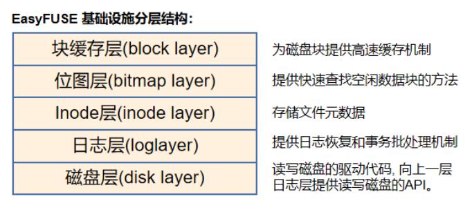

# EasyFUSE 的系统架构

该文档用于详细描述 EasyFUSE 的系统架构，包括运行原理、分层结构、代码结构等的说明。

## 1. EasyFUSE 运行原理

各种形式的文件系统操作最后都是转成文件系统调用，然后陷入内核，经过 Linux VFS 处理，对于挂载用户态文件系统的文件系统操作 libfuse 会把调用请求转发给我们的 EasyFUSE 接口实现，我们的接口实现内部会对 EasyFUSE 底层的各层数据结构进行操作，然后返回结果，最后再由 libfuse 转发到 VFS 再到文件系统调用的结果返回，最终完成对文件系统的操作。

\[1\] [Linux VFS (Virtual file system)](https://en.wikipedia.org/wiki/Virtual_file_system) 为用户程序提供文件系统操作的统一接口，屏蔽不同文件系统的差异和操作细节。  
\[2\] EasyFUSE 底层设施，在其之上实现 libfuse 接口，里面主要是disk、inode、data block、log、bitmap 这五个层的机制的实现代码。  
\[3\] libfuse 转发 VFS 的请求会调用相应的 libfuse 接口的实现。  
\[4\] [libfuse](https://github.com/libfuse/libfuse) 是一个 Linux 支持的、开源的、转发 Linux VFS 与 FUSE 之间的请求和响应来实现用户态文件系统的 (FUSE) 的库。  

## 2. EasyFUSE 底层设施(分层结构)

### 1. 磁盘层 [[/src/disk.c](../src/disk.c)]

1. 实际读写磁盘的驱动代码（EasyFUSE 这里是用文件模拟磁盘读写），驱动这里有逻辑块号与物理块号的映射关系（EasyFUSE实现是1对1），该层向日志层提供事务提交时来真正读写物理磁盘的API。
2. 物理磁盘存储格式结构：

boot block是加载OS kernel的地方，这里未使用；super block存储的是该物理磁盘分区的元数据，比如各层的块数和开始块号；inode blocks 和 data blocks 的块数按照一定比例根据磁盘大小自动计算；另外位图使用固定32个块，这个值限定了FS最大的大小，我们这里为了简化未实现如ext4的块组的方式，只有一个块组，所以我们的位图块数需要多一些。  

### 2. 日志层 [[/src/log.c](../src/log.c)]

    - 向上一层block cache层提供写日志头信息块的接口，用于事务提交；向文件系统调用提供事务进出、事务批处理提交的功能。

    <!-- 
    1. block cache layer —— 为数据读写和上一层inode层读写inode结构提高数据块缓存机制。
    2. inode cache layer —— 存储文件信息，被上一层路径层根据路径查找到inode结构，得到文件信息和数据块号。
    3. path layer —— 路径层，为上一层的我们自己文件系统的系统调用作为参数使用。
    4. FUSE system calls layer —— 我们自己定义的系统调用，实现上一层的libfuse接口。
    5. libfuse layer —— libfuse库作为中间层，监听上一层的VFS的请求，返回我们自己的结果。
    6. linux VFS 机制 —— linux使用的虚拟文件系统机制，为上一层的glibc标准库的文件系统调用提供对应文件系统的功能 实现，比如对一个ext4 FS的文件操作，自然向下调用ext4 FS实现，如果是对我们的FUSE文件操作，那么就会进入下一层libfuse layer，让libfuse layer转发请求到我们用户态的实现。
    7. glibc FS system calls layer —— 标准库的文件系统调用函数，不知要对哪一个文件系统调用。
    8.  打开文件描述 layer —— 指向inode，linux内核维护的信息。
    9.  文件描述符 layer —— 指向打开文件描述，linux内核维护的信息。  
   （注：为了简单，我们实现的是high-lever libfuse接口，使用路径；另外fd的层次是高于VFS的，也就是说打开不同文件系统而来的fd和相同FS的打开得到的fd没有什么不同，都是顺序递增，不可能重复的，由内核维护，fd和FUSE一点关系都没有） -->

## 3. EasyFUSE 源代码结构说明

   - [disk.c](src/disk.c) 磁盘层(disk layer)代码，里面是读写磁盘的驱动程序（我们的这里是通过linux文件API的模拟），也是逻辑块号转物理块号被驱动程序使用的地方（不过我们的实现使用的逻辑块与物理块是一对一的关系），同时这里也放置了位图层代码（因为代码耦合且相关代码较少）。
   - [log.c](src/log.c) 日志层(logging layer)代码，关于日志恢复、事务批处理提交的代码，只有这个层才实际直接写入磁盘，block layer是借助该层写磁盘数据的（除了在加载日志层之前要初始化磁盘文件例外）。
   - [block_cache.c](src/block_cache.c) 数据块缓存层(block layer)代码，提供磁盘上的数据块加载到内存的缓存机制。
   - [inode_cache.c](src/inode_cache.c) Inode缓存层(block layer)代码，提供磁盘上的Inode结构加载到内存的缓存机制，不过实际上Inode读写请求的操作是通过 block layer 这一中间层实现的，会先读到 block cache，然后再从 block cache读到 inode cache。
  
4. 文件系统调用
    to do 目录改变了

   - [userspace_fs_call.h](include/userspace_fs_calls.h) 声明所有FUSE的文件系统调用。
   - [fs.c](src/fs.c) 实现各文件系统调用内部使用的各种辅助函数。
   - [userspace_fs_open.c](src/userspace_fs_open.c) 实现 libfuse open 打开文件接口。
   - [userspace_fs_stat.c](src/userspace_fs_stat.c) 实现 libfuse getattr 获取文件属性接口。
   - to do

5. 其他代码：
   - [init_disk.c](src/init_disk.c) 用于格式化磁盘，会清空磁盘所有数据，写入一些必要初始化磁盘数据，只需调用一次。
   - [util.c](src/util.c) 用于输出各种辅助信息，以便debug的辅助函数库
   - [main.c](src/main.c) 主函数所在，使用libfuse接口实现我们的FUSE。
   - to do
